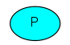
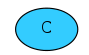
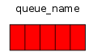
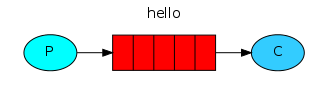
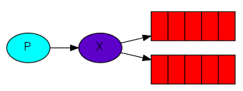
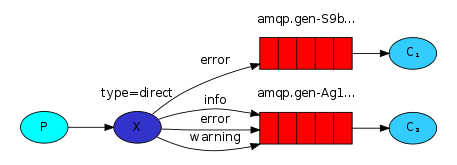

# Tutorial #2 : RabbitMQ

Este tutorial es inspirado por los [tutoriales de RabbitMQ](https://www.rabbitmq.com/getstarted.html).

## 1. Introducción

[RabbitMQ](https://www.rabbitmq.com/) es un software open-source desarrollado a partir de 2007, bajo licencia [Mozilla Public](https://en.wikipedia.org/wiki/Mozilla_Public_License), y escrito con el lenguaje de programación Erlang. En 2020, su última versión es la 3.8.9.

RabbitMQ es un *broker* de mensajes: un componente de software intermedio que recibe y reenvía mensajes. Se puede pensarlo como una oficina de correos encargado de entregar mensajes. Softwares similares son por ejemplo Apache ActiveMQ y Apache Kafka y otras soluciones propietarias como Google Cloud Pub, Amazon MQ, etc. 

RabbitMQ utiliza los conceptos siguientes:

- ***Producer*** (Productor): un componente de software que envia un mensaje.

- ***Consumer*** (Consumidor): un componente de software que espera por recibir un mensaje.

- ***Queue*** (Cola): una estructura de datos que manipula RabbitMQ para guardar en memoría los mensajes que recibe. RabbitMQ puede gestionar varias colas. Los Productores pueden enviar mensajes en varias colas y los Consumidores recibir mensajes desde varias colas.

**Nota Bene**: un componente de software puede ser *Producer* y *Consumer*. El *broker* (RabbitMQ), el *Producer* y el *Consumer* no tienen necesariamente que ser alojado en la misma máquina. 

## 2. Un primer ejemplo en Python: 'Hello World'

Como MySQL, RabbitMQ funciona como un programa "servidor". Tiene clientes para todos los lenguajes de programación incluso Python. En Python, el programa cliente de RabbitMQ se llama *pika*.

    pip install pika

Escribiremos dos pequeños programas en Python; un productor que envía un único mensaje, y un consumidor que recibe los mensajes y los imprime.  En el siguiente diagrama, "P" es nuestro productor y "C" es nuestro consumidor. El cuadro del medio es una cola, un buffer de mensajes que RabbitMQ guarda en nombre del consumidor.

En send.py:

    #!/usr/bin/env python
    import pika
    
    #Conexión al servidor RabbitMQ
    connection = pika.BlockingConnection(pika.ConnectionParameters('localhost'))
    channel = connection.channel()
    
    #Creación de la cola
    channel.queue_declare(queue='hello')
    
    #Publicación del mensaje
    channel.basic_publish(exchange='',
                          routing_key='hello',
                          body='Hello World!')
    
    print(" [x] Sent 'Hello World!'")
    
    connection.close()

**Nota bene**: Estamos conectados en un servidor RabbitMQ en la máquina local. Si quisiéramos conectarnos a un instancia de RabbitMQ en una máquina diferente, simplemente especificaríamos su nombre o dirección IP aquí.

En receive.py:

    #!/usr/bin/env python
    import pika, sys, os
    
    def main():
    
        #Conexión al servidor RabbitMQ   
        connection = pika.BlockingConnection(pika.ConnectionParameters(host='localhost'))
        channel = connection.channel()
    
        #Nos aseguramos que existe una cola 'hello'
        channel.queue_declare(queue='hello')
    
    
        #Recibir mensajes de la cola es más complejo. Funciona suscribiendo una función de devolución de llamada ("callback"). Cada vez que recibimos un mensaje, esta función "callback" es llamada por la libreria Pika. En nuestro caso, esta función imprimirá en la pantalla el contenido del mensaje.
        def callback(ch, method, properties, body):
            print(" [x] Received %r" % body)
    
        channel.basic_consume(queue='hello', on_message_callback=callback, auto_ack=True)
    
        print(' [*] Waiting for messages. To exit press CTRL+C')
        channel.start_consuming()
    
        #Bocle infinita
    if __name__ == '__main__':
        try:
            main()
        except KeyboardInterrupt:
            print('Interrupted')
            try:
                sys.exit(0)
            except SystemExit:
                os._exit(0)

Como pueden observar, los componentes de nuestro programa send.py y receive.py funcionan de forma autónoma e ignoran totalmente la existencia del otro componente. En Arquitectura de Software, llamamos este concepto: el **acoplamiento/desacoplamiento**.

- Definición "Acoplamiento": el acoplamiento se refiere al **grado de interdependencia que tienen dos unidades de software entre sí**, entendiendo por unidades de software: clases, subtipos, métodos, módulos, funciones, bibliotecas, etc.

**Nota Bene**: para consultar cuáles son las colas manejadas por el servidor RabbitMQ:

    sudo rabbitmqctl list_queues

## 3. Pattern 'Work queue': utilizar colas para distribuir carga de trabajo

En el primer ejemplo, vimos cómo dos programas podian comunicar a través de RabbitMQ. En este segundo ejemplo, veremos cómo RabbitMQ puede ser una solución arquitectónica para distribuir tareas que consumen mucho tiempo entre varios componentes, creando **colas de trabajo**.

La idea principal de las colas de trabajo es evitar hacer una tarea que requiera muchos recursos inmediatamente y tener que esperar a que se complete. En su lugar, programamos la tarea para que se haga más tarde. Encapsulamos una tarea como un mensaje y la enviamos a la cola. Un proceso de trabajo que se ejecuta en segundo plano hará aparecer las tareas y eventualmente ejecutará el trabajo. Cuando se ejecutan muchos trabajadores las tareas se comparten entre ellos.

En este ejemplo, enviaremos String que representan tareas complejas. No tenemos una tarea del mundo real, como imágenes que deben ser redimensionadas o archivos pdf que deben ser renderizados, así que vamos a fingir que estamos ocupados - usando la función `time.sleep()`. Tomaremos el número de puntos de la cadena como su complejidad; cada punto representará un segundo de "trabajo". Por ejemplo, una tarea falsa descrita por *"Hola..."* tomará tres segundos.

Modificaremos ligeramente el código send.py de nuestro ejemplo anterior, para permitir que se envíen mensajes arbitrarios desde la línea de comandos. Este programa programará tareas en nuestra cola de trabajo, así que llamémoslo **new_task.py**:

    #!/usr/bin/env python
    import pika
    import sys
    
    #Nuestra tarea pasada como argumento
    message = ' '.join(sys.argv[1:]) or "Hello World!"
    
    #Conexión al servidor RabbitMQ
    connection = pika.BlockingConnection(pika.ConnectionParameters('localhost'))
    channel = connection.channel()
    
    #Creación de la cola
    channel.queue_declare(queue='hello')
    
    #Publicación del mensaje
    channel.basic_publish(exchange='',
                          routing_key='hello',
                          body=message)
    print(" [x] Sent %r" % message)
    
    connection.close()

El programa consumidor llamado worker.py necesita falsificar un segundo de trabajo por cada punto del cuerpo del mensaje.

    #!/usr/bin/env python
    import pika, sys, os
    import time
    
    def main():
    
        #Conexión al servidor RabbitMQ   
        connection = pika.BlockingConnection(pika.ConnectionParameters(host='localhost'))
        channel = connection.channel()
    
        #Nos aseguramos que existe una cola 'hello'
        channel.queue_declare(queue='hello')
    
    
        #Recibir mensajes de la cola es más complejo. Funciona suscribiendo una función de devolución de llamada ("callback"). Cada vez que recibimos un mensaje, esta función "callback" es llamada por la libreria Pika. En nuestro caso, esta función imprimirá en la pantalla el contenido del mensaje.
        def callback(ch, method, properties, body):
            print(" [x] Received %r" % body.decode())
            time.sleep(body.count(b'.'))
            print(" [x] Done")
    
        channel.basic_consume(queue='hello', on_message_callback=callback, auto_ack=True)
    
        print(' [*] Waiting for messages. To exit press CTRL+C')
        channel.start_consuming()
    
        #Bocle infinita
    if __name__ == '__main__':
        try:
            main()
        except KeyboardInterrupt:
            print('Interrupted')
            try:
                sys.exit(0)
            except SystemExit:
                os._exit(0)

Despacho de tareas: utilizar una cola de trabajo permite de paralelizar fácilmente el trabajo. Si estamos acumulando un atraso de trabajo, podemos simplemente añadir más trabajadores y de esa manera, escalar de forma horizontal.

Ejemplo con un producer P1 y tres consumidores C1, C2, C3.

--> Por defecto, RabbitMQ enviará cada mensaje al siguiente consumidor, en secuencia. En promedio, cada consumidor recibirá el mismo número de mensajes. Esta forma de distribuir los mensajes se llama "round-robin".

## 4. 'Message acknowledgment': Acuse de recibo del mensaje

¿Qué pasa si un componente consumidor empieza una tarea y muere sin lograr terminar la tarea?

Con nuestro código anterior, el mensaje/tarea se pierde. Tambien se pierde todos los mensajes que habian sido asignados a este consumidor. Para asegurarse que ningun mensaje se pierda, RabbitMQ utiliza el concepto de *Message acknowledgment* (ack). Cuando un consumidor recibe y termina de procesar un mensaje, envia un acuse de recibo a RabbitMQ para informar que el servidor puede borrar el mensaje.

Si un consumidor muere (la conexión se cierra o se pierde la conexión TCP) sin enviar un ack, RabbitMQ entenderá que un mensaje no ha sido procesado completamente y lo reenviará en la cola. Si hay otros consumidores en línea al mismo tiempo, lo volverá a entregar rápidamente a otro consumidor. De esta manera puede estar seguro de que ningún mensaje se pierde, incluso si los trabajadores mueren ocasionalmente. 

in **worker_ack.py**:

    def callback(ch, method, properties, body):
        print(" [x] Received %r" % body.decode())
        time.sleep( body.count('.') )
        print(" [x] Done")
        ch.basic_ack(delivery_tag = method.delivery_tag)
    
    channel.basic_consume(queue='hello', on_message_callback=callback)

**Nota Bene**: 
- no olvidar utilizar el método `basic_ack` sino RabbitMQ reenviará cada mensaje y llenará su memoría de mensaje no terminado.
- para monitorear si hay mensajes no enviados en ciertas colas:    `sudo rabbitmqctl list_queues name messages_ready messages_unacknowledged`

## 5. Durabilidad de los mensajes

¿Qué pasa si el servidor RabbitMQ se apaga? ¿Se pierden los mensajes en las colas?

Por defecto, cuando se apaga, RabbitMQ olvidará las colas y los mensajes. Pero podemos especificar si queremos guardar las colas y sus mensajes de manera durable.

Para las colas:
`channel.queue_declare(queue='task_queue', durable=True)`

Para los mensajes (al momento de publicar):

    channel.basic_publish(exchange='',
                          routing_key="task_queue",
                          body=message,
                          properties=pika.BasicProperties(
                             delivery_mode = 2, # make message persistent
                          ))

## 6. Despacho con más equidad

Observamos que el despacho "round robin" puede generar alguna inequidad si ciertas tareas pesadas están asignadas al mismo consumidor y tareas livianas a otros consumidores. 

Para evitar este problema, podemos especificar el número máximo de mensajes que se puede asignar a un consumidor. Por ejemplo, podemos especificar que no se puede asignar nuevos mensajes a un consumidor si ya esta ocupado:

    channel.basic_qos(prefetch_count=1)

## 7. Pattern 'Publish/Subscribe': utilizar colas para difundir un mensaje a varios componentes

### Sobre el concepto *exchange* de RabbitMQ...

A parte de los conceptos de **producer**, **consumer** y **queue**, RabbitMQ utiliza un cuarto concepto: **exchange**.

Un *exchange* es una variable de RabbitMQ intermedia entre los productores y las colas. Una idea de la arquitectura de RabbitMQ es que los productores no deberían enviar directamente un mensaje en la cola pero pasar por un *exchange*. Podemos ver los *exchange* como los puntos de accesos a RabbitMQ que pueden utilizar los otros componentes.

Existen varios tipos de *exchange*: *direct*, *topic*, *headers* y *fanout*. En el ejemplo siguiente, utilizaremos un *exchange* de tipo *fanout*.

Un *exchange* de tipo *fanout* publica los mensajes que recibe en todas las colas que conoce.

Para listar los *exchange* en el servidor RabbitMQ: `sudo rabbitmqctl list_exchanges`

En los ejemplos anteriores, utilizamos un *exchange* por defecto:

    channel.basic_publish(exchange='',
                          routing_key='hello',
                          body=message)
En los próximos ejemplos, utilizaremos un *exchange* propio que llamaremos 'logs':

    channel.basic_publish(exchange='logs',
                          routing_key='',
                          body=message)

### Ejemplo...

En el patrón "work queue", cada mensaje esta enviado a un solo consumidor. En el patrón "publish/Subscribe", un mismo mensaje esta enviado a varios consumidores.

Para ilustrar el patrón, vamos a construir un simple sistema de logs. Consistirá en dos programas: el primero emitirá mensajes de logs y el segundo los recibirá e imprimirá.

En **emit_logs.py**:

    #!/usr/bin/env python
    import pika
    import sys
    
    connection = pika.BlockingConnection(
        pika.ConnectionParameters(host='localhost'))
    channel = connection.channel()
    
    #Creamos el exchange 'logs' de tipo 'fanout'
    channel.exchange_declare(exchange='logs', exchange_type='fanout')
    
    message = ' '.join(sys.argv[1:]) or "info: Hello World!"
    
    #Publicamos los mensajes a través del exchange 'logs' 
    channel.basic_publish(exchange='logs', routing_key='', body=message)
    
    print(" [x] Sent %r" % message)
    connection.close()

En **receive_logs.py**:

    #!/usr/bin/env python
    import pika
    
    connection = pika.BlockingConnection(
        pika.ConnectionParameters(host='localhost'))
    channel = connection.channel()
    
    #El consumidor utiliza el exchange 'log'
    channel.exchange_declare(exchange='logs', exchange_type='fanout')
    
    #Se crea un cola temporaria exclusiva para este consumidor (búzon de correos)
    result = channel.queue_declare(queue='', exclusive=True)
    queue_name = result.method.queue
    
    #La cola se asigna a un 'exchange'
    channel.queue_bind(exchange='logs', queue=queue_name)
    
    print(' [*] Waiting for logs. To exit press CTRL+C')
    
    def callback(ch, method, properties, body):
        print(" [x] %r" % body)
    
    channel.basic_consume(
        queue=queue_name, on_message_callback=callback, auto_ack=True)
    
    channel.start_consuming()

Se puede verificar que RabbitMQ creó las buenas asignaciones (*bindings*) con el comando: `sudo rabbitmqctl list_bindings`

## 8. Pattern "Publish/Subscribe with routing": difundir mensajes a los componentes según un enrutamiento específico

Hasta ahora, nuestro sistema de logs transmite todos los mensajes a todos los consumidores. Queremos ampliarlo para permitir filtrar los mensajes en función de su gravedad. Por ejemplo, podemos querer que el consumidor que está escribiendo los mensajes de registro en el disco sólo reciba errores críticos, y no desperdicie espacio en el disco en mensajes de advertencia o de registro de información.

Utilizaremos un 'exchange'  de tipo **direct** para enrutear los mensajes como en la configuración siguiente:

En **emit_logs_direct.py**:

    #!/usr/bin/env python
    import pika
    import sys
    
    connection = pika.BlockingConnection(
        pika.ConnectionParameters(host='localhost'))
    channel = connection.channel()
    
    channel.exchange_declare(exchange='direct_logs', exchange_type='direct')
    
    severity = sys.argv[1] if len(sys.argv) > 1 else 'info'
    message = ' '.join(sys.argv[2:]) or 'Hello World!'
    channel.basic_publish(
        exchange='direct_logs', routing_key=severity, body=message)
    print(" [x] Sent %r:%r" % (severity, message))
    connection.close()

En **receive_logs_direct.py**:

    #!/usr/bin/env python
    import pika
    import sys
    
    connection = pika.BlockingConnection(
        pika.ConnectionParameters(host='localhost'))
    channel = connection.channel()
    
    channel.exchange_declare(exchange='direct_logs', exchange_type='direct')
    
    result = channel.queue_declare(queue='', exclusive=True)
    queue_name = result.method.queue
    
    severities = sys.argv[1:]
    if not severities:
        sys.stderr.write("Usage: %s [info] [warning] [error]\n" % sys.argv[0])
        sys.exit(1)
    
    for severity in severities:
        channel.queue_bind(
            exchange='direct_logs', queue=queue_name, routing_key=severity)
    
    print(' [*] Waiting for logs. To exit press CTRL+C')
    
    def callback(ch, method, properties, body):
        print(" [x] %r:%r" % (method.routing_key, body))
    
    
    channel.basic_consume(
        queue=queue_name, on_message_callback=callback, auto_ack=True)
    
    channel.start_consuming()

- python emit_logs_direct.py error "test"
- python receive_logs_direct warning info

## 9. Pattern 'Request-Reply': esperar la respuesta del consumidor

¿Qué pasa si el productor necesita una respuesta del consumidor?
En informatica, este patrón es conocido habitualmente como ***Remote procedure call (RPC)***.

Vamos a usar RabbitMQ para construir un sistema basado sobre el patrón "Request-Reply". Un productor pregunta el número N de la serie de Fibonacci, un consumidor le devuelve el resultado.

En **rpc-reply.py**:

    #!/usr/bin/env python
    import pika
    
    connection = pika.BlockingConnection(
        pika.ConnectionParameters(host='localhost'))
    
    channel = connection.channel()
    
    channel.queue_declare(queue='rpc_queue')
    
    def fib(n):
        if n == 0:
            return 0
        elif n == 1:
            return 1
        else:
            return fib(n - 1) + fib(n - 2)
    
    def on_request(ch, method, props, body):
        n = int(body)
    
        print(" [.] fib(%s)" % n)
        response = fib(n)
    
        ch.basic_publish(exchange='',
                         routing_key=props.reply_to,
                         properties=pika.BasicProperties(correlation_id = \
                                                             props.correlation_id),
                         body=str(response))
        ch.basic_ack(delivery_tag=method.delivery_tag)
    
    channel.basic_qos(prefetch_count=1)
    channel.basic_consume(queue='rpc_queue', on_message_callback=on_request)
    
    print(" [x] Awaiting RPC requests")
    channel.start_consuming()

En **rpc-request.py**:

    #!/usr/bin/env python
    import pika
    import uuid
    
    class FibonacciRpcClient(object):
    
        def __init__(self):
            self.connection = pika.BlockingConnection(
                pika.ConnectionParameters(host='localhost'))
    
            self.channel = self.connection.channel()
    
            result = self.channel.queue_declare(queue='', exclusive=True)
            self.callback_queue = result.method.queue
    
            self.channel.basic_consume(
                queue=self.callback_queue,
                on_message_callback=self.on_response,
                auto_ack=True)
    
        def on_response(self, ch, method, props, body):
            if self.corr_id == props.correlation_id:
                self.response = body
    
        def call(self, n):
            self.response = None
            self.corr_id = str(uuid.uuid4())
            self.channel.basic_publish(
                exchange='',
                routing_key='rpc_queue',
                properties=pika.BasicProperties(
                    reply_to=self.callback_queue,
                    correlation_id=self.corr_id,
                ),
                body=str(n))
            while self.response is None:
                self.connection.process_data_events()
            return int(self.response)
    
    
    fibonacci_rpc = FibonacciRpcClient()
    
    print(" [x] Requesting fib(30)")
    response = fibonacci_rpc.call(30)
    print(" [.] Got %r" % response)

## 10. Tarea

Implementar una arquitectura de software basada en RabbitMQ con los componentes siguientes:

- un componente 'productor' envia mensajes de tipo: "wikipedia (Chile)", "youtube (Chile)"
- un componente 'consumidor' realiza búsqueda en wikipedia e imprime el resultado
- un componente 'consumidor' realiza búsqueda en youtube e imprime el resultado

Nota Bene:
- API Youtube para Python: https://developers.google.com/youtube/v3/quickstart/python
- API Wikipedia para Python: 
datos: [https://pypi.org/project/wikipedia/](https://pypi.org/project/wikipedia/)
número de vistas de las páginas [https://pypi.org/project/pageviewapi/](https://pypi.org/project/pageviewapi/)
